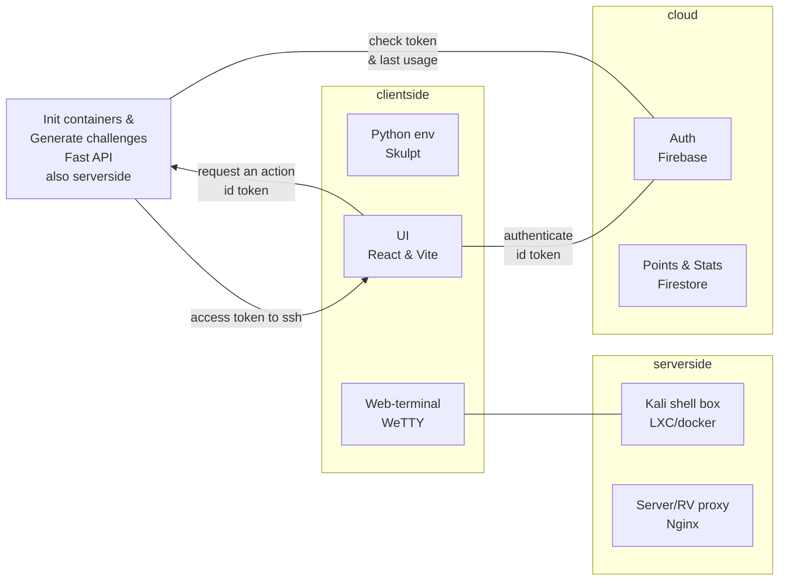

# BrinellCTF

## API

The api will be the intermediate between the UI and the backend.

First the api will take the id token from the authenticated user, and ask firebase if its valid.

### Submit challenge

Each challenge will have a seperate endpoint and the api will check that the flag is valid, if it is and the user hasn't already been issued points for it, he will be issued points in the DB. 

### SSH boxes via the API

The api will check the DB for the last time a box was issued, and if a long enough time has passed it will spin one up, and send back the ssh info to the UI.

## SSH boxes 

For the user to solve challenges in a CLI they don't have they can use the SSH boxes. Boxes will only be up for 30 minutes at a time with a 24hr cooldown to mitigate abuse.

SSH servers on the boxes will be on port 443 and be connected to via a domain under *.ssh.brinellctf.net

The star will be a short hash, and as each 

Nginx r