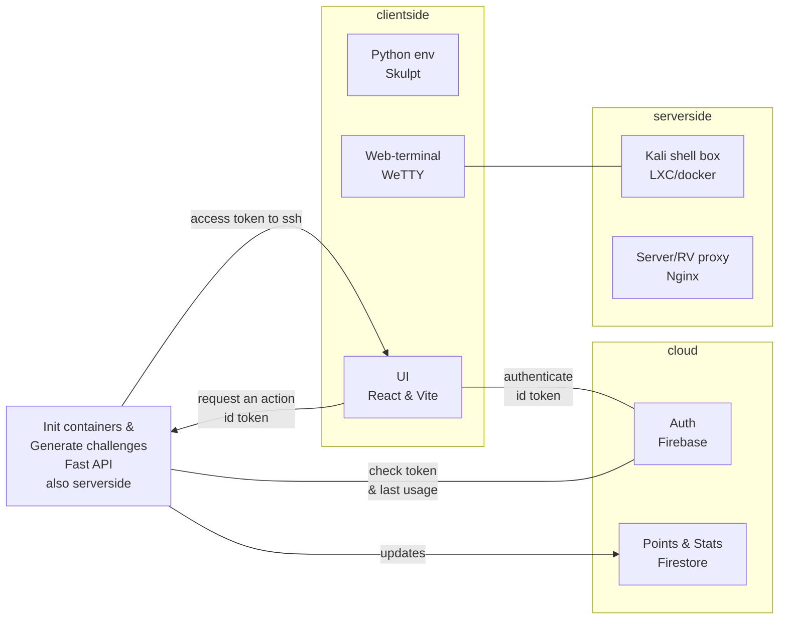

# BrinellCTF

## API

The api will be the intermediate between the UI and the backend.

First the api will take the id token from the authenticated user, and ask firebase if its valid.

### Submit challenge

Each challenge will have a seperate endpoint and the api will check that the flag is valid, if it is and the user hasn't already been issued points for it, he will be issued points in the DB. 

### SSH boxes via the API

The api will check the DB for the last time a box was issued, and if a long enough time has passed it will spin one up, and send back the ssh info to the UI.

## SSH boxes 

The api will run a script to turn on a box and a daemon monitors the boxes shutting them down if they've been up for 30 minutes. 

For the user to solve challenges in a CLI they don't have they can use the SSH boxes. Boxes will only be up for 30 minutes at a time with a 24hr cooldown to mitigate abuse.

SSH servers on the boxes will be on port 443 and be connected to via a domain under *.ssh.brinellctf.net

The star will be a short hash, and as each box is added and removed the nginx config will be updated and gracefully reloaded on the fly to upstream proxy the container. 

Image for the box shall have WeTTY with requirements installed and configured to port 443 and to autostart.
Via a script a user is created WITHOUT sudo privilige. Users credentials are returned. 

---

Possible other implementation:

We have like 50 ready boxes and nginx subdomains and theyre turned on and off wiping them and returning user creds.  

### Generate challenge

It is possible to have both static and dynamic challenges. The higher point challenges should be dynamic to prevent cheating by copying others flags, for that a challenge must a have generation script that produces the challenge with a unique flag. 

This could also be applied, modifying ssh boxes, putting some files in them and having them be challenge boxes activated on demand. 

A challenge could constitute a zip file, an image with metadata, another page in the site with hidden info, etc. 